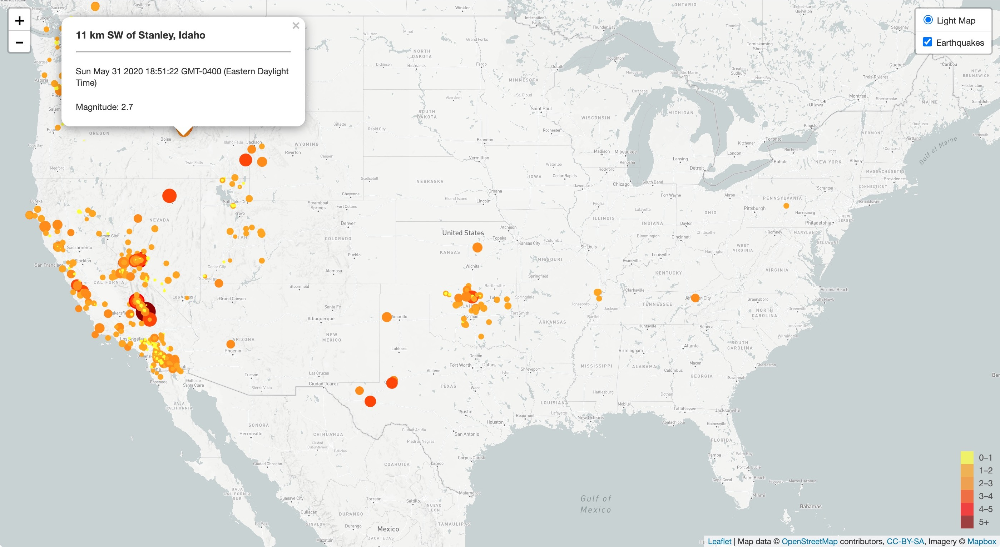

# leaflet-challenge 🍃
First of all, I've finally learned during project week that it's crucial to COMMIT OFTEN, and from now on, I do so!  
But, moving on, this HW was all about visualizing data with Leaflet.js...  
This time around, I am invited to the United States Geological Survey.  
"The USGS is interested in building a new set of tools that will allow them visualize their earthquake data. They collect a massive amount of data from all over the world each day, but they lack a meaningful way of displaying it. Their hope is that being able to visualize their data will allow them to better educate the public and other government organizations (and hopefully secure more funding..) on issues facing our planet."  
The first task was to visualize an earthquake; the data given to me was from the USGS GeoJSON Feed (updated every five minutes). The `url` field in the JSON representation of the data gives me that very data...  
Importing and visualizing the map was the second part. I was asked to do the following:  
- *Your data markers should reflect the magnitude of the earthquake in their size and color. Earthquakes with higher magnitudes should appear larger and darker in color.*  
- *Include popups that provide additional information about the earthquake when a marker is clicked.*  
- *Create a legend that will provide context for your map data.*  
- *Your visualization should look something like the map above.*  
Here is a snapshot of my work. 🙂  

